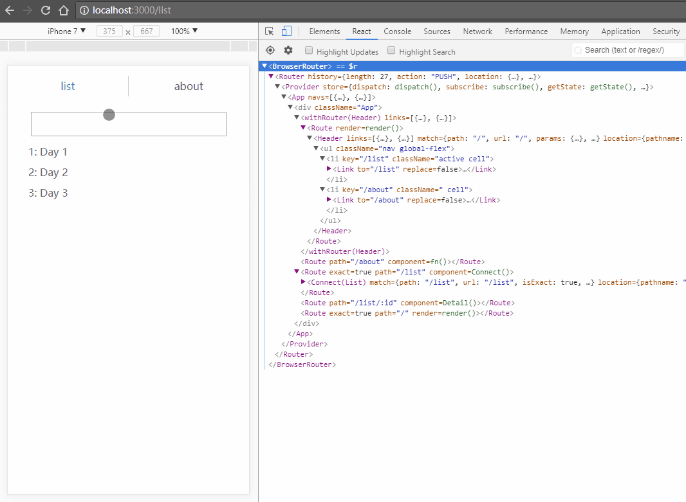

# react-all

模板项目，用于快速开始使用React及React官方或推荐库开发建站。

## 架构特性

单页面应用，前端渲染页面组件、控制路由。使用react、react-router、redux，结合webpack。

## 构建和启动命令

``` bash
# install dependencies
npm install

# serve with hot reload at localhost:3000
npm start

# build for production
npm run build

# run tests
npm run test
```

详见[]()。

## 文件结构

| Path | Content |
| :--- | :--- |
| -- | -- |

## 快速开发

可参考示例代码进行组件、路由、状态数据的快速开发。



### 组件


### 路由


### 状态数据


## 本地开发和测试


## 常用特性速查参考

| 特性 | 示例 |
| ：---： | ：--- |
| -- | -- |
